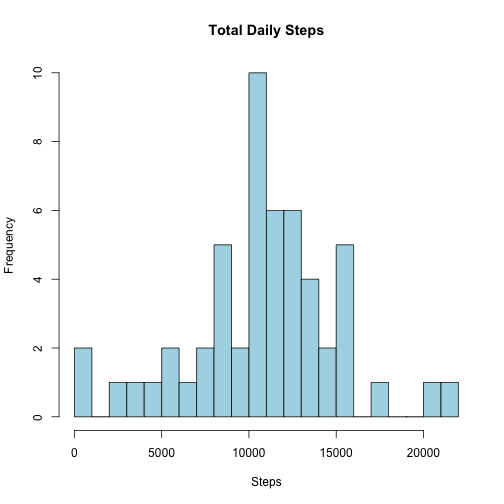
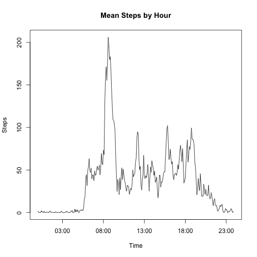
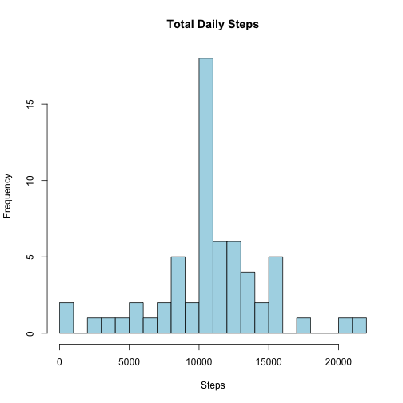
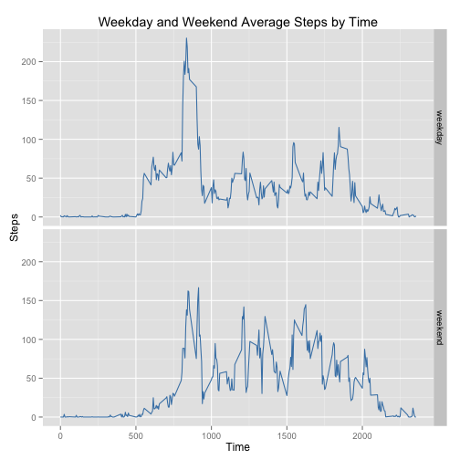

## Loading and preprocessing the data

```r
library(data.table)
data <- fread(unzip("./data/activity.zip"), sep=",", header=TRUE)
```

## What is mean total number of steps taken per day?

```r
library(xtable)
dailySteps <- as.vector(data[,sum(steps), by=date])
setnames(dailySteps, "V1", "steps")
hist(dailySteps[,steps], breaks=30, main="Total Daily Steps", xlab = "Steps", col="lightblue")
```

 

```r
mean <- as.vector(data[,mean(steps), by=date])
setnames(mean, "V1", "mean")
median <- as.vector(data[,as.double(median(steps)), by=date])
setnames(median, "V1", "median")
xt <- xtable(merge(mean,median, by="date"))
print(xt, type="html")
```

<!-- html table generated in R 3.1.1 by xtable 1.7-4 package -->
<!-- Mon Nov 17 19:23:17 2014 -->
<table border=1>
<tr> <th>  </th> <th> date </th> <th> mean </th> <th> median </th>  </tr>
  <tr> <td align="right"> 1 </td> <td> 2012-10-01 </td> <td align="right">  </td> <td align="right">  </td> </tr>
  <tr> <td align="right"> 2 </td> <td> 2012-10-02 </td> <td align="right"> 0.44 </td> <td align="right"> 0.00 </td> </tr>
  <tr> <td align="right"> 3 </td> <td> 2012-10-03 </td> <td align="right"> 39.42 </td> <td align="right"> 0.00 </td> </tr>
  <tr> <td align="right"> 4 </td> <td> 2012-10-04 </td> <td align="right"> 42.07 </td> <td align="right"> 0.00 </td> </tr>
  <tr> <td align="right"> 5 </td> <td> 2012-10-05 </td> <td align="right"> 46.16 </td> <td align="right"> 0.00 </td> </tr>
  <tr> <td align="right"> 6 </td> <td> 2012-10-06 </td> <td align="right"> 53.54 </td> <td align="right"> 0.00 </td> </tr>
  <tr> <td align="right"> 7 </td> <td> 2012-10-07 </td> <td align="right"> 38.25 </td> <td align="right"> 0.00 </td> </tr>
  <tr> <td align="right"> 8 </td> <td> 2012-10-08 </td> <td align="right">  </td> <td align="right">  </td> </tr>
  <tr> <td align="right"> 9 </td> <td> 2012-10-09 </td> <td align="right"> 44.48 </td> <td align="right"> 0.00 </td> </tr>
  <tr> <td align="right"> 10 </td> <td> 2012-10-10 </td> <td align="right"> 34.38 </td> <td align="right"> 0.00 </td> </tr>
  <tr> <td align="right"> 11 </td> <td> 2012-10-11 </td> <td align="right"> 35.78 </td> <td align="right"> 0.00 </td> </tr>
  <tr> <td align="right"> 12 </td> <td> 2012-10-12 </td> <td align="right"> 60.35 </td> <td align="right"> 0.00 </td> </tr>
  <tr> <td align="right"> 13 </td> <td> 2012-10-13 </td> <td align="right"> 43.15 </td> <td align="right"> 0.00 </td> </tr>
  <tr> <td align="right"> 14 </td> <td> 2012-10-14 </td> <td align="right"> 52.42 </td> <td align="right"> 0.00 </td> </tr>
  <tr> <td align="right"> 15 </td> <td> 2012-10-15 </td> <td align="right"> 35.20 </td> <td align="right"> 0.00 </td> </tr>
  <tr> <td align="right"> 16 </td> <td> 2012-10-16 </td> <td align="right"> 52.38 </td> <td align="right"> 0.00 </td> </tr>
  <tr> <td align="right"> 17 </td> <td> 2012-10-17 </td> <td align="right"> 46.71 </td> <td align="right"> 0.00 </td> </tr>
  <tr> <td align="right"> 18 </td> <td> 2012-10-18 </td> <td align="right"> 34.92 </td> <td align="right"> 0.00 </td> </tr>
  <tr> <td align="right"> 19 </td> <td> 2012-10-19 </td> <td align="right"> 41.07 </td> <td align="right"> 0.00 </td> </tr>
  <tr> <td align="right"> 20 </td> <td> 2012-10-20 </td> <td align="right"> 36.09 </td> <td align="right"> 0.00 </td> </tr>
  <tr> <td align="right"> 21 </td> <td> 2012-10-21 </td> <td align="right"> 30.63 </td> <td align="right"> 0.00 </td> </tr>
  <tr> <td align="right"> 22 </td> <td> 2012-10-22 </td> <td align="right"> 46.74 </td> <td align="right"> 0.00 </td> </tr>
  <tr> <td align="right"> 23 </td> <td> 2012-10-23 </td> <td align="right"> 30.97 </td> <td align="right"> 0.00 </td> </tr>
  <tr> <td align="right"> 24 </td> <td> 2012-10-24 </td> <td align="right"> 29.01 </td> <td align="right"> 0.00 </td> </tr>
  <tr> <td align="right"> 25 </td> <td> 2012-10-25 </td> <td align="right"> 8.65 </td> <td align="right"> 0.00 </td> </tr>
  <tr> <td align="right"> 26 </td> <td> 2012-10-26 </td> <td align="right"> 23.53 </td> <td align="right"> 0.00 </td> </tr>
  <tr> <td align="right"> 27 </td> <td> 2012-10-27 </td> <td align="right"> 35.14 </td> <td align="right"> 0.00 </td> </tr>
  <tr> <td align="right"> 28 </td> <td> 2012-10-28 </td> <td align="right"> 39.78 </td> <td align="right"> 0.00 </td> </tr>
  <tr> <td align="right"> 29 </td> <td> 2012-10-29 </td> <td align="right"> 17.42 </td> <td align="right"> 0.00 </td> </tr>
  <tr> <td align="right"> 30 </td> <td> 2012-10-30 </td> <td align="right"> 34.09 </td> <td align="right"> 0.00 </td> </tr>
  <tr> <td align="right"> 31 </td> <td> 2012-10-31 </td> <td align="right"> 53.52 </td> <td align="right"> 0.00 </td> </tr>
  <tr> <td align="right"> 32 </td> <td> 2012-11-01 </td> <td align="right">  </td> <td align="right">  </td> </tr>
  <tr> <td align="right"> 33 </td> <td> 2012-11-02 </td> <td align="right"> 36.81 </td> <td align="right"> 0.00 </td> </tr>
  <tr> <td align="right"> 34 </td> <td> 2012-11-03 </td> <td align="right"> 36.70 </td> <td align="right"> 0.00 </td> </tr>
  <tr> <td align="right"> 35 </td> <td> 2012-11-04 </td> <td align="right">  </td> <td align="right">  </td> </tr>
  <tr> <td align="right"> 36 </td> <td> 2012-11-05 </td> <td align="right"> 36.25 </td> <td align="right"> 0.00 </td> </tr>
  <tr> <td align="right"> 37 </td> <td> 2012-11-06 </td> <td align="right"> 28.94 </td> <td align="right"> 0.00 </td> </tr>
  <tr> <td align="right"> 38 </td> <td> 2012-11-07 </td> <td align="right"> 44.73 </td> <td align="right"> 0.00 </td> </tr>
  <tr> <td align="right"> 39 </td> <td> 2012-11-08 </td> <td align="right"> 11.18 </td> <td align="right"> 0.00 </td> </tr>
  <tr> <td align="right"> 40 </td> <td> 2012-11-09 </td> <td align="right">  </td> <td align="right">  </td> </tr>
  <tr> <td align="right"> 41 </td> <td> 2012-11-10 </td> <td align="right">  </td> <td align="right">  </td> </tr>
  <tr> <td align="right"> 42 </td> <td> 2012-11-11 </td> <td align="right"> 43.78 </td> <td align="right"> 0.00 </td> </tr>
  <tr> <td align="right"> 43 </td> <td> 2012-11-12 </td> <td align="right"> 37.38 </td> <td align="right"> 0.00 </td> </tr>
  <tr> <td align="right"> 44 </td> <td> 2012-11-13 </td> <td align="right"> 25.47 </td> <td align="right"> 0.00 </td> </tr>
  <tr> <td align="right"> 45 </td> <td> 2012-11-14 </td> <td align="right">  </td> <td align="right">  </td> </tr>
  <tr> <td align="right"> 46 </td> <td> 2012-11-15 </td> <td align="right"> 0.14 </td> <td align="right"> 0.00 </td> </tr>
  <tr> <td align="right"> 47 </td> <td> 2012-11-16 </td> <td align="right"> 18.89 </td> <td align="right"> 0.00 </td> </tr>
  <tr> <td align="right"> 48 </td> <td> 2012-11-17 </td> <td align="right"> 49.79 </td> <td align="right"> 0.00 </td> </tr>
  <tr> <td align="right"> 49 </td> <td> 2012-11-18 </td> <td align="right"> 52.47 </td> <td align="right"> 0.00 </td> </tr>
  <tr> <td align="right"> 50 </td> <td> 2012-11-19 </td> <td align="right"> 30.70 </td> <td align="right"> 0.00 </td> </tr>
  <tr> <td align="right"> 51 </td> <td> 2012-11-20 </td> <td align="right"> 15.53 </td> <td align="right"> 0.00 </td> </tr>
  <tr> <td align="right"> 52 </td> <td> 2012-11-21 </td> <td align="right"> 44.40 </td> <td align="right"> 0.00 </td> </tr>
  <tr> <td align="right"> 53 </td> <td> 2012-11-22 </td> <td align="right"> 70.93 </td> <td align="right"> 0.00 </td> </tr>
  <tr> <td align="right"> 54 </td> <td> 2012-11-23 </td> <td align="right"> 73.59 </td> <td align="right"> 0.00 </td> </tr>
  <tr> <td align="right"> 55 </td> <td> 2012-11-24 </td> <td align="right"> 50.27 </td> <td align="right"> 0.00 </td> </tr>
  <tr> <td align="right"> 56 </td> <td> 2012-11-25 </td> <td align="right"> 41.09 </td> <td align="right"> 0.00 </td> </tr>
  <tr> <td align="right"> 57 </td> <td> 2012-11-26 </td> <td align="right"> 38.76 </td> <td align="right"> 0.00 </td> </tr>
  <tr> <td align="right"> 58 </td> <td> 2012-11-27 </td> <td align="right"> 47.38 </td> <td align="right"> 0.00 </td> </tr>
  <tr> <td align="right"> 59 </td> <td> 2012-11-28 </td> <td align="right"> 35.36 </td> <td align="right"> 0.00 </td> </tr>
  <tr> <td align="right"> 60 </td> <td> 2012-11-29 </td> <td align="right"> 24.47 </td> <td align="right"> 0.00 </td> </tr>
  <tr> <td align="right"> 61 </td> <td> 2012-11-30 </td> <td align="right">  </td> <td align="right">  </td> </tr>
   </table>


## What is the average daily activity pattern?

```r
# sum steps by interval
intervalSteps <- data[,mean(steps, na.rm=TRUE), by=interval]
setnames(intervalSteps, "V1", "steps")
# Pad interval values and convert to POSIXct
intervalSteps$time <- as.POSIXct(strptime(sprintf("%04d",intervalSteps$interval), format="%H%M"), format = "%H:%M")
plot(intervalSteps$time, intervalSteps$steps, type="l", xlab="Time", ylab="Steps")
title("Mean Steps by Hour")
```

 

```r
maxSteps <- cat('Max Steps at: ', strftime(unique(intervalSteps[steps==max(steps), time]), format="%H:%M"))
```

```
## Max Steps at:  08:35
```

```r
print(maxSteps, type='html')
```

```
## NULL
```


## Imputing missing values

```r
# Total number of rows with missing values
incompleteRows <- cat('Rows with missing values: ', sum(is.na(data$steps)))
```

Rows with missing values:  2304

```r
print(incompleteRows, type='html')
```

NULL

```r
filledData <- merge(data, intervalSteps, by = "interval")
filledData[is.na(steps.x), steps.x := as.integer(steps.y)]
```

       interval steps.x       date  steps.y                time
    1:        0       1 2012-10-01 1.716981 2014-11-17 00:00:00
    2:        0       0 2012-10-02 1.716981 2014-11-17 00:00:00
    3:        0       0 2012-10-03 1.716981 2014-11-17 00:00:00
    4:        0      47 2012-10-04 1.716981 2014-11-17 00:00:00
    5:        0       0 2012-10-05 1.716981 2014-11-17 00:00:00
   ---                                                         
17564:     2355       0 2012-11-26 1.075472 2014-11-17 23:55:00
17565:     2355       0 2012-11-27 1.075472 2014-11-17 23:55:00
17566:     2355       0 2012-11-28 1.075472 2014-11-17 23:55:00
17567:     2355       0 2012-11-29 1.075472 2014-11-17 23:55:00
17568:     2355       1 2012-11-30 1.075472 2014-11-17 23:55:00

```r
filledData[,steps.y:=NULL]
```

       interval steps.x       date                time
    1:        0       1 2012-10-01 2014-11-17 00:00:00
    2:        0       0 2012-10-02 2014-11-17 00:00:00
    3:        0       0 2012-10-03 2014-11-17 00:00:00
    4:        0      47 2012-10-04 2014-11-17 00:00:00
    5:        0       0 2012-10-05 2014-11-17 00:00:00
   ---                                                
17564:     2355       0 2012-11-26 2014-11-17 23:55:00
17565:     2355       0 2012-11-27 2014-11-17 23:55:00
17566:     2355       0 2012-11-28 2014-11-17 23:55:00
17567:     2355       0 2012-11-29 2014-11-17 23:55:00
17568:     2355       1 2012-11-30 2014-11-17 23:55:00

```r
setnames(filledData, "steps.x", "steps")
filledData[order(date,interval)]
```

       interval steps       date                time
    1:        0     1 2012-10-01 2014-11-17 00:00:00
    2:        5     0 2012-10-01 2014-11-17 00:05:00
    3:       10     0 2012-10-01 2014-11-17 00:10:00
    4:       15     0 2012-10-01 2014-11-17 00:15:00
    5:       20     0 2012-10-01 2014-11-17 00:20:00
   ---                                              
17564:     2335     4 2012-11-30 2014-11-17 23:35:00
17565:     2340     3 2012-11-30 2014-11-17 23:40:00
17566:     2345     0 2012-11-30 2014-11-17 23:45:00
17567:     2350     0 2012-11-30 2014-11-17 23:50:00
17568:     2355     1 2012-11-30 2014-11-17 23:55:00

```r
dailyFilledSteps <- as.vector(filledData[,sum(steps), by=date])
setnames(dailyFilledSteps, "V1", "steps")
hist(dailyFilledSteps[,steps], breaks=30, main="Total Daily Steps", xlab = "Steps", col="lightblue")
```

 

```r
meanFilled <- as.vector(filledData[,mean(steps), by=date])
setnames(meanFilled, "V1", "mean")
medianFilled <- as.vector(filledData[,as.double(median(steps)), by=date])
setnames(medianFilled, "V1", "median")
xt <- xtable(merge(meanFilled, medianFilled, by="date"))
print(xt, type="html")
```

<!-- html table generated in R 3.1.1 by xtable 1.7-4 package -->
<!-- Mon Nov 17 19:23:18 2014 -->
<table border=1>
<tr> <th>  </th> <th> date </th> <th> mean </th> <th> median </th>  </tr>
  <tr> <td align="right"> 1 </td> <td> 2012-10-01 </td> <td align="right"> 36.95 </td> <td align="right"> 33.50 </td> </tr>
  <tr> <td align="right"> 2 </td> <td> 2012-10-02 </td> <td align="right"> 0.44 </td> <td align="right"> 0.00 </td> </tr>
  <tr> <td align="right"> 3 </td> <td> 2012-10-03 </td> <td align="right"> 39.42 </td> <td align="right"> 0.00 </td> </tr>
  <tr> <td align="right"> 4 </td> <td> 2012-10-04 </td> <td align="right"> 42.07 </td> <td align="right"> 0.00 </td> </tr>
  <tr> <td align="right"> 5 </td> <td> 2012-10-05 </td> <td align="right"> 46.16 </td> <td align="right"> 0.00 </td> </tr>
  <tr> <td align="right"> 6 </td> <td> 2012-10-06 </td> <td align="right"> 53.54 </td> <td align="right"> 0.00 </td> </tr>
  <tr> <td align="right"> 7 </td> <td> 2012-10-07 </td> <td align="right"> 38.25 </td> <td align="right"> 0.00 </td> </tr>
  <tr> <td align="right"> 8 </td> <td> 2012-10-08 </td> <td align="right"> 36.95 </td> <td align="right"> 33.50 </td> </tr>
  <tr> <td align="right"> 9 </td> <td> 2012-10-09 </td> <td align="right"> 44.48 </td> <td align="right"> 0.00 </td> </tr>
  <tr> <td align="right"> 10 </td> <td> 2012-10-10 </td> <td align="right"> 34.38 </td> <td align="right"> 0.00 </td> </tr>
  <tr> <td align="right"> 11 </td> <td> 2012-10-11 </td> <td align="right"> 35.78 </td> <td align="right"> 0.00 </td> </tr>
  <tr> <td align="right"> 12 </td> <td> 2012-10-12 </td> <td align="right"> 60.35 </td> <td align="right"> 0.00 </td> </tr>
  <tr> <td align="right"> 13 </td> <td> 2012-10-13 </td> <td align="right"> 43.15 </td> <td align="right"> 0.00 </td> </tr>
  <tr> <td align="right"> 14 </td> <td> 2012-10-14 </td> <td align="right"> 52.42 </td> <td align="right"> 0.00 </td> </tr>
  <tr> <td align="right"> 15 </td> <td> 2012-10-15 </td> <td align="right"> 35.20 </td> <td align="right"> 0.00 </td> </tr>
  <tr> <td align="right"> 16 </td> <td> 2012-10-16 </td> <td align="right"> 52.38 </td> <td align="right"> 0.00 </td> </tr>
  <tr> <td align="right"> 17 </td> <td> 2012-10-17 </td> <td align="right"> 46.71 </td> <td align="right"> 0.00 </td> </tr>
  <tr> <td align="right"> 18 </td> <td> 2012-10-18 </td> <td align="right"> 34.92 </td> <td align="right"> 0.00 </td> </tr>
  <tr> <td align="right"> 19 </td> <td> 2012-10-19 </td> <td align="right"> 41.07 </td> <td align="right"> 0.00 </td> </tr>
  <tr> <td align="right"> 20 </td> <td> 2012-10-20 </td> <td align="right"> 36.09 </td> <td align="right"> 0.00 </td> </tr>
  <tr> <td align="right"> 21 </td> <td> 2012-10-21 </td> <td align="right"> 30.63 </td> <td align="right"> 0.00 </td> </tr>
  <tr> <td align="right"> 22 </td> <td> 2012-10-22 </td> <td align="right"> 46.74 </td> <td align="right"> 0.00 </td> </tr>
  <tr> <td align="right"> 23 </td> <td> 2012-10-23 </td> <td align="right"> 30.97 </td> <td align="right"> 0.00 </td> </tr>
  <tr> <td align="right"> 24 </td> <td> 2012-10-24 </td> <td align="right"> 29.01 </td> <td align="right"> 0.00 </td> </tr>
  <tr> <td align="right"> 25 </td> <td> 2012-10-25 </td> <td align="right"> 8.65 </td> <td align="right"> 0.00 </td> </tr>
  <tr> <td align="right"> 26 </td> <td> 2012-10-26 </td> <td align="right"> 23.53 </td> <td align="right"> 0.00 </td> </tr>
  <tr> <td align="right"> 27 </td> <td> 2012-10-27 </td> <td align="right"> 35.14 </td> <td align="right"> 0.00 </td> </tr>
  <tr> <td align="right"> 28 </td> <td> 2012-10-28 </td> <td align="right"> 39.78 </td> <td align="right"> 0.00 </td> </tr>
  <tr> <td align="right"> 29 </td> <td> 2012-10-29 </td> <td align="right"> 17.42 </td> <td align="right"> 0.00 </td> </tr>
  <tr> <td align="right"> 30 </td> <td> 2012-10-30 </td> <td align="right"> 34.09 </td> <td align="right"> 0.00 </td> </tr>
  <tr> <td align="right"> 31 </td> <td> 2012-10-31 </td> <td align="right"> 53.52 </td> <td align="right"> 0.00 </td> </tr>
  <tr> <td align="right"> 32 </td> <td> 2012-11-01 </td> <td align="right"> 36.95 </td> <td align="right"> 33.50 </td> </tr>
  <tr> <td align="right"> 33 </td> <td> 2012-11-02 </td> <td align="right"> 36.81 </td> <td align="right"> 0.00 </td> </tr>
  <tr> <td align="right"> 34 </td> <td> 2012-11-03 </td> <td align="right"> 36.70 </td> <td align="right"> 0.00 </td> </tr>
  <tr> <td align="right"> 35 </td> <td> 2012-11-04 </td> <td align="right"> 36.95 </td> <td align="right"> 33.50 </td> </tr>
  <tr> <td align="right"> 36 </td> <td> 2012-11-05 </td> <td align="right"> 36.25 </td> <td align="right"> 0.00 </td> </tr>
  <tr> <td align="right"> 37 </td> <td> 2012-11-06 </td> <td align="right"> 28.94 </td> <td align="right"> 0.00 </td> </tr>
  <tr> <td align="right"> 38 </td> <td> 2012-11-07 </td> <td align="right"> 44.73 </td> <td align="right"> 0.00 </td> </tr>
  <tr> <td align="right"> 39 </td> <td> 2012-11-08 </td> <td align="right"> 11.18 </td> <td align="right"> 0.00 </td> </tr>
  <tr> <td align="right"> 40 </td> <td> 2012-11-09 </td> <td align="right"> 36.95 </td> <td align="right"> 33.50 </td> </tr>
  <tr> <td align="right"> 41 </td> <td> 2012-11-10 </td> <td align="right"> 36.95 </td> <td align="right"> 33.50 </td> </tr>
  <tr> <td align="right"> 42 </td> <td> 2012-11-11 </td> <td align="right"> 43.78 </td> <td align="right"> 0.00 </td> </tr>
  <tr> <td align="right"> 43 </td> <td> 2012-11-12 </td> <td align="right"> 37.38 </td> <td align="right"> 0.00 </td> </tr>
  <tr> <td align="right"> 44 </td> <td> 2012-11-13 </td> <td align="right"> 25.47 </td> <td align="right"> 0.00 </td> </tr>
  <tr> <td align="right"> 45 </td> <td> 2012-11-14 </td> <td align="right"> 36.95 </td> <td align="right"> 33.50 </td> </tr>
  <tr> <td align="right"> 46 </td> <td> 2012-11-15 </td> <td align="right"> 0.14 </td> <td align="right"> 0.00 </td> </tr>
  <tr> <td align="right"> 47 </td> <td> 2012-11-16 </td> <td align="right"> 18.89 </td> <td align="right"> 0.00 </td> </tr>
  <tr> <td align="right"> 48 </td> <td> 2012-11-17 </td> <td align="right"> 49.79 </td> <td align="right"> 0.00 </td> </tr>
  <tr> <td align="right"> 49 </td> <td> 2012-11-18 </td> <td align="right"> 52.47 </td> <td align="right"> 0.00 </td> </tr>
  <tr> <td align="right"> 50 </td> <td> 2012-11-19 </td> <td align="right"> 30.70 </td> <td align="right"> 0.00 </td> </tr>
  <tr> <td align="right"> 51 </td> <td> 2012-11-20 </td> <td align="right"> 15.53 </td> <td align="right"> 0.00 </td> </tr>
  <tr> <td align="right"> 52 </td> <td> 2012-11-21 </td> <td align="right"> 44.40 </td> <td align="right"> 0.00 </td> </tr>
  <tr> <td align="right"> 53 </td> <td> 2012-11-22 </td> <td align="right"> 70.93 </td> <td align="right"> 0.00 </td> </tr>
  <tr> <td align="right"> 54 </td> <td> 2012-11-23 </td> <td align="right"> 73.59 </td> <td align="right"> 0.00 </td> </tr>
  <tr> <td align="right"> 55 </td> <td> 2012-11-24 </td> <td align="right"> 50.27 </td> <td align="right"> 0.00 </td> </tr>
  <tr> <td align="right"> 56 </td> <td> 2012-11-25 </td> <td align="right"> 41.09 </td> <td align="right"> 0.00 </td> </tr>
  <tr> <td align="right"> 57 </td> <td> 2012-11-26 </td> <td align="right"> 38.76 </td> <td align="right"> 0.00 </td> </tr>
  <tr> <td align="right"> 58 </td> <td> 2012-11-27 </td> <td align="right"> 47.38 </td> <td align="right"> 0.00 </td> </tr>
  <tr> <td align="right"> 59 </td> <td> 2012-11-28 </td> <td align="right"> 35.36 </td> <td align="right"> 0.00 </td> </tr>
  <tr> <td align="right"> 60 </td> <td> 2012-11-29 </td> <td align="right"> 24.47 </td> <td align="right"> 0.00 </td> </tr>
  <tr> <td align="right"> 61 </td> <td> 2012-11-30 </td> <td align="right"> 36.95 </td> <td align="right"> 33.50 </td> </tr>
   </table>


## Are there differences in activity patterns between weekdays and weekends?

```r
library(ggplot2)
daysOfWeek <- filledData[, weekdays(as.POSIXct(date))]
isWeekend <- grepl("\\<Saturday\\>|\\<Sunday\\>", daysOfWeek)
filledData$weekday <- factor(isWeekend, labels = c("weekday", "weekend"))
weekdayIntervalSteps <- filledData[weekday=='weekday',mean(steps, na.rm=TRUE), by=interval]
setnames(weekdayIntervalSteps, 'V1', 'steps')
weekdayIntervalSteps$weekday <- "weekday"

weekendIntervalSteps <- filledData[weekday=='weekend',mean(steps, na.rm=TRUE), by=interval]
setnames(weekendIntervalSteps, 'V1', 'steps')
weekendIntervalSteps$weekday <- "weekend"

weekendAverages <- rbind(weekendIntervalSteps, weekdayIntervalSteps)

ggplot(weekendAverages, aes(interval, steps)) +
        geom_line(color="steelblue") +
        facet_grid(weekday ~ .) +
        labs(title="Weekday and Weekend Average Steps by Time") +
        labs(y="Steps", x="Time")
```

 
