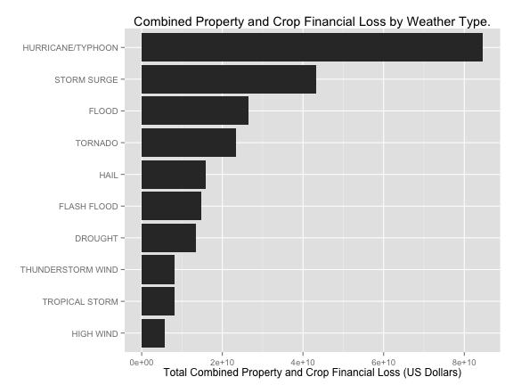

Health and Financial Risk of Severe Weather Events
========================================================

## Synopsis

This report analyzes the top severe weather events in the United States between the years 1998 to 2011. 
We look at the top ten events by combined injuries and fatalities and combined property and crop financial damage.
The severe weather event data is obtained from the U.S. National Oceanic and Atmospheric Administration's (NOAA) storm database which is collected by the National Weather Service for events across the U.S. 
We specifically used data for the years 1996 to 2011 because it encompasses most of the complete data set and has fewer inconsistencies in event classification then the previous years. From these data, we found that for both events, those most harmful to population health and those that have the greatest economic consequences, had a single event type that contributed twice or more to the total effect than the next severe weather event type.  The weather event most harmful to population health was the tornado, and the event that has the greatest economic consequences is the hurricane (or typhoon).

## Data Processing
### Required Libraries
Two additional libraries were required.


```r
library(data.table)
library(ggplot2)
```

### Loading the Raw Data
The data for this assignment come in the form of a comma-separated-value file compressed via the bzip2 algorithm to reduce its size.

* [Storm Data](https://d396qusza40orc.cloudfront.net/repdata%2Fdata%2FStormData.csv.bz2) [47Mb]

There is also some documentation of the database available. Here you will find how some of the variables are constructed/defined.

* National Weather Service [Storm Data Documentation](https://d396qusza40orc.cloudfront.net/repdata%2Fpeer2_doc%2Fpd01016005curr.pdf)

* National Climatic Data Center Storm Events [FAQ](https://d396qusza40orc.cloudfront.net/repdata%2Fpeer2_doc%2FNCDC%20Storm%20Events-FAQ%20Page.pdf)

The events in the database start in the year 1950 and end in November 2011. In the earlier years of the database there are generally fewer events recorded, most likely due to a lack of good records. More recent years should be considered more complete.


```r
localFile <- "./data/repdata-data-StormData.csv.bz2"
fileUrl <- "https://d396qusza40orc.cloudfront.net/repdata%2Fdata%2FStormData.csv.bz2"

if(!file.exists("data")){dir.create("data")}

if(!file.exists(localFile)){
    download.file(fileUrl, destfile=localFile, method="curl")
    dateDownloaded <- date()   
}

rawData <- data.table(read.csv(bzfile(localFile)))
```
### Processing the data set
A subset of the data occurring after 01/01/1998 was selected to be used instead of the entire data set.  The subset encompasses two thirds of the entire data set yet has less than one third of the total unique events types.  This means the sample contains most of the original set with much less noise due to inconsistent classification.

In addition to subsampling, a couple of edits were made to the original data set to correct errors and combine misclassified event types.  Finally, two numeric columns 'PROPMULTIPLIER' and 'CROPMULTIPLIER' were added to calculate the property and crop damages based on the character multiplier provided.

The following edits were made:
* Renamed 'TSTM WIND' to the accepted current event 'THUNDERSTORM WIND'
* Renamed 'HURRICANE' and 'TYPHOON' to to the accepted current event 'HURRICANE/TYPHOON' 
* Changed PROPDMGEXP for REFNUM 605943 from 'B' to 'M' to fix an incorrect data entry. 
* Alphabetical characters were used to signify magnitude: “K” for thousands, “M” for millions, and “B” for billions. These characters were mapped to their value and used as multipliers for the property and crop damages.


```r
# Covert BGN_TIME column to Date type and subset events from 1998 to 2011.
rawData <- rawData[, BGN_DATE:=as.Date(strptime(rawData[, BGN_DATE], format="%m/%d/%Y %H:%M:%S"))]
data <- rawData[ BGN_DATE >= "1998-01-01"]

# Renaming common EVTYPE's to one of the accepted 48 permitted events.
data <- data[EVTYPE=="TSTM WIND", EVTYPE:="THUNDERSTORM WIND"]
data <- data[EVTYPE=="HURRICANE", EVTYPE:="HURRICANE/TYPHOON"]
data <- data[EVTYPE=="TYPHOON", EVTYPE:="HURRICANE/TYPHOON"]

# Fixing REFNUM 605943 misclasification
data[REFNUM==605943,]$PROPDMGEXP = "M"

# Build property damage multiplier
data$PROPMULTIPLE <- 1
data$PROPMULTIPLE[data$PROPDMGEXP =="K"] <- 1000
data$PROPMULTIPLE[data$PROPDMGEXP =="M"] <- 1000000
data$PROPMULTIPLE[data$PROPDMGEXP =="B"] <- 1000000000

# Build crop damage multiplier
data$CROPMULTIPLE <- 1
data$CROPMULTIPLE[data$CROPDMGEXP =="K"] <- 1000
data$CROPMULTIPLE[data$CROPDMGEXP =="M"] <- 1000000
data$CROPMULTIPLE[data$CROPDMGEXP =="B"] <- 1000000000
```

## Results
The top ten events most harmful to population health and with the greatest economic consequences are presented in the following two subsections.

### Top Health Risk
The following figure shows the events most harmful to population health.  Overall tornados are by far the largest health risk accounting for about 40% of total combined health risk.  The next largest contributor excessive heat comes in at around 15% of the total combined health risk.  Not surprisingly the greatest risks to human life or injury come from high winds, heat and deep water events. These events are primary causes of common injury or death in humans through physical trauma, hyperthermia and drowning.


```r
# Find combined injury and fatalities per event type.
healthData <- data[,list(FATALITIES=sum(FATALITIES), INJURIES=sum(INJURIES)), by=EVTYPE]
healthData$HEALTHRISK <- healthData[,FATALITIES+INJURIES]

# Plot top ten events by combined health risk.
healthData <- head(healthData[order(-HEALTHRISK)], 10)
ggplot(healthData, aes(x=reorder(EVTYPE,HEALTHRISK), y=HEALTHRISK)) + 
    geom_bar(stat="identity") +
    coord_flip() + 
    xlab("") +
    ylab("Total Combined Fatality and Injury") +
    ggtitle("Combined Fatality and Injury by Weather Type.")
```

 

### Top Financial Risk
The following figure shows the events with the greatest economic consequences. Overall hurrinaces (typhoons) present the largest financial risk accounting for about 33% of total combined financial risk.  The next largest contributor storm surge comes in at around 17%, flood events 13% and tornados at 10%.  These top 4 events account for 73% of the economic consequences from severe weather events and are remarkably similar.  Both hurricanes and tornados are high wind events that can cause structural damage and flood events and storm surges are deep water events that do major damage to things near the ground.  In addition storm surges are defined as being caused by a hurricane , typhoon or tropical storm which strengthens the connection between these events.


```r
# Find combined property and crop damange per event type.
financialData <- data[,list(PROPDMG=sum(PROPDMG*PROPMULTIPLE), CROPDMG=sum(CROPDMG*CROPMULTIPLE)), by=EVTYPE]
financialData$FINANCIALRISK <- financialData[,PROPDMG+CROPDMG]

# Plot top ten events by combined financial risk.
financialData <- head(financialData[order(-FINANCIALRISK)], 10)
ggplot(financialData, aes(x=reorder(EVTYPE,FINANCIALRISK), y=FINANCIALRISK)) + 
    geom_bar(stat="identity") + 
    coord_flip() +
    xlab("") +
    ylab("Total Combined Property and Crop Financial Loss (US Dollars)") +
    ggtitle("Combined Property and Crop Financial Loss by Weather Type.")
```

 
