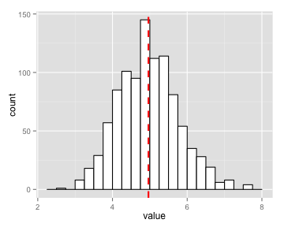
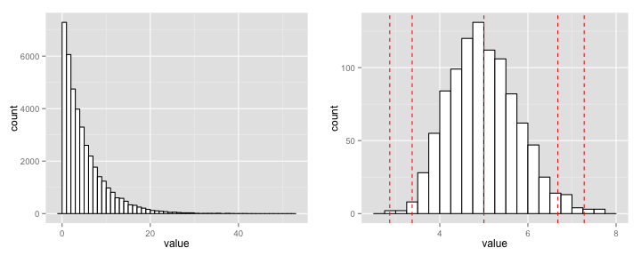

---------------------------
title: "Properties of the distribution of the mean of 40 random exponential distributions"
output: pdf_document
--------------------------
The exponential distribution can be simulated in R with rexp(n, lambda) where lambda is the rate parameter. The mean of exponential distribution is 1/lambda and the standard deviation is also also 1/lambda. In this simulation, we investigate the distribution of averages of 40 exponential distributions with a lambda = 0.2.

We illustrate via simulation and associated explanatory text the following properties of the distribution:

1. Show where the distribution is centered at and compare it to the theoretical center of the distribution.

2. Show how variable it is and compare it to the theoretical variance of the distribution.

3. Show that the distribution is approximately normal.
 

## Simulating 1000 random exponential distributions 
We need to do a thousand or so simulated averages of 40 exponentials.  The code to simulate 1000 exponential distributions and the mean of 1000 exponential distributions is shown below.

```r
library(ggplot2)
library(gridExtra)

# Number of observations.
observations <- 40
# Rate (lambda)
lambda <- 0.2

# Simulate 1000 runs of 40 random exponential distributions and store them in a data frame.
expData = NULL
for (i in 1 : 1000) expData = c(expData, rexp(observations, lambda))
expDat <- data.frame( value = expData)

# Simulate 1000 averages of 40 random exponential distributions and store them in a data frame.
meanExpData = NULL
for (i in 1 : 1000) meanExpData = c(meanExpData, mean(rexp(observations, lambda)))
meanDat <- data.frame(value = meanExpData)
```

## Finding the center of the distribution
The theoretical center of distribution for an exponential distribution is 1/lambda.  For this simulation the lambda was 0.2, so the theoretical center should be 5.  The plot below has the mean of the simulation imposed over the distribution as a dashed line.

```r
ggplot(meanDat, aes(x=value)) + 
    geom_histogram(binwidth=.25, colour="black", fill="white") + 
    geom_vline(aes(xintercept=mean(value)),
               color="red", linetype="dashed", size=1)
```

 

Comparing the theoretical mean to that of the simulation:


```r
# Theoretical sample mean.
1/lambda
```

```
## [1] 5
```

```r
# Simulation sample mean.
round(mean(meanDat$value), 2)
```

```
## [1] 5.02
```

## Finding the variance of the distribution
The theoretical sampling variance, or the variance of the sample mean, is equal to 1/nλ^2 for a sample mean of n random draws from an exponential distribution with mean 1/λ and variance 1/λ^2.

Comparing the theoretical variance to that of the simulation:

```r
# Theoretical sampling variance.
1/(observations * lambda^2)
```

```
## [1] 0.625
```

```r
# Simulation sampling variance.
round(var(meanDat$value), 3)
```

```
## [1] 0.643
```


### The distribution is approximately normal.
Exponential random distributions have a minimum at zero, and quickly fall off to a long right tail. The normal distribution is symmetric around the mean with a bell-shape.

The when plotted in a histogram, the simulation of 1000 exponential random distributions (below left) makes an exponential shape.  In comparison the histogram for the mean of 1000 simulated 40 random exponential variables (below right) has the characteristic normal distribution. Three standard deviations for a normal distribution have been plotted over the approximately normal distribution for comparison.

The normal distribution of the mean of 40 random exponential variables is due to the Central Limit Theorem; the mean of large number of independent random variables will be approximately normally distributed, regardless of the underlying distribution.


```r
plot1 <- ggplot(expDat, aes(x=value)) + 
    geom_histogram(binwidth=1, colour="black", fill="white")
plot2 <- ggplot(meanDat, aes(x=value)) + 
    geom_histogram(binwidth=.25, colour="black", fill="white") +
    geom_vline(xintercept=quantile(rnorm(1000, mean=5), 
                                   probs = c(0.01, 0.05, .5, .95, .99), 
                                   names = FALSE),
               color="red", linetype="dashed", csize=1)
grid.arrange(plot1, plot2, ncol=2) 
```

 
