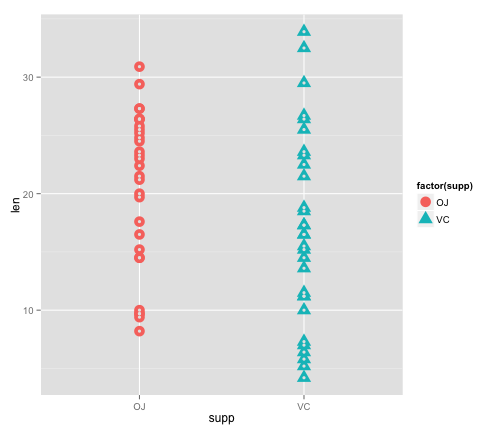
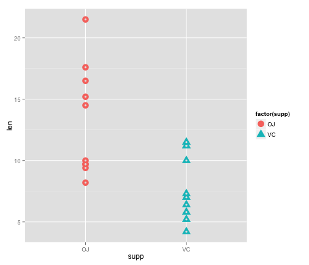
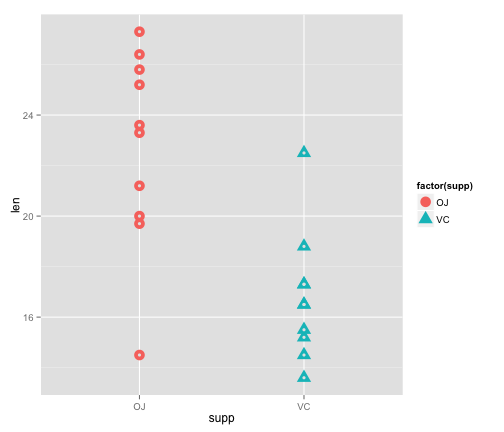
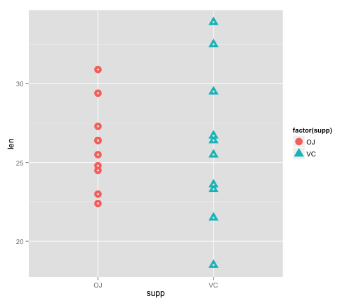

The effects of Vitimin C on tooth growth in guinea pigs
========================================================

This report analyzes the ToothGrowth data in the R datasets package. 
Confidence intervals were used to compare tooth growth by supp and dose.

## Basic summary of the ToothGrowth dataset.
The description of the dataset is as follows:

* The response is the length of odontoblasts (teeth) in each of 10 guinea pigs at each of three dose levels of Vitamin C (0.5, 1, and 2 mg) with each of two delivery methods (orange juice or ascorbic acid).

The data is divided into three columns; tooth length, delivery method and dose. A basic summary of the ToothGrowth dataset is not very helpful for understanding the effects of Vitimin C on tooth growth.  Plotting the entire data set shows a wide variance in tooth length for both delivery methods, it's not obviously clear which method is superior.


```r
library(datasets)
library(ggplot2)
summary(ToothGrowth)
```

```
##       len        supp         dose      
##  Min.   : 4.20   OJ:30   Min.   :0.500  
##  1st Qu.:13.07   VC:30   1st Qu.:0.500  
##  Median :19.25           Median :1.000  
##  Mean   :18.81           Mean   :1.167  
##  3rd Qu.:25.27           3rd Qu.:2.000  
##  Max.   :33.90           Max.   :2.000
```

```r
ggplot(ToothGrowth, aes(supp, len)) + 
    geom_point(aes(shape = factor(supp), colour = factor(supp)), size = 5) +
    geom_point(colour="grey90", size = 1.5)
```

 

To compare the effects of dosage of on tooth length, the data needs to be controled for both dosage and delivery method.


```r
# Subset tooth length by supplement and dose.
oj   <- subset(ToothGrowth, supp == 'OJ')
oj.5 <- oj$len[oj$dose == 0.5]
oj1  <- oj$len[oj$dose == 1.0]
oj2  <- oj$len[oj$dose == 2.0]

vc   <- subset(ToothGrowth, supp=='VC')
vc.5 <- vc$len[vc$dose == 0.5]
vc1  <- vc$len[vc$dose == 1.0]
vc2  <- vc$len[vc$dose == 2.0]
```

## Observing the effects of dose on tooth length.
For each dosage we compare the effect of tooth length by delivery method.  As the overall dosage increases, the overall length increases.  Based on the description of the dataset this report assumes independent and identically distributed variables.  The variance between delivery methods was not equal for all doses, so all confidence intervals are calculated assuming to have unequal variance.

### Tooth length by delivery method for a 0.5 mg dosage.
When given a 0.5 mg suppliment of Vitimin C the orange juice delivery method produces longer tooth length.  The confidence interval indicates that given 100 random trials, 95% of them would have results contain tooth lengths between 1.7 mm and 8.8 mm longer when using orange juice as the delivery method.

```r
# Confidence interval and plot after controlling for 0.5 mg dose.
ggplot(subset(ToothGrowth, dose == 0.5), aes(supp, len)) + 
    geom_point(aes(shape = factor(supp), colour = factor(supp)), size = 5) + 
    geom_point(colour="grey90", size = 1.5)
```

 

```r
t.test(oj.5, vc.5, var.equal = FALSE)
```

```
## 
## 	Welch Two Sample t-test
## 
## data:  oj.5 and vc.5
## t = 3.1697, df = 14.969, p-value = 0.006359
## alternative hypothesis: true difference in means is not equal to 0
## 95 percent confidence interval:
##  1.719057 8.780943
## sample estimates:
## mean of x mean of y 
##     13.23      7.98
```

### Tooth length by delivery method for a 1.0 mg dosage.
When given a 1.0 mg suppliment of Vitimin C again we see that orange juice delivery method produces longer tooth length.  The confdence interval is slightly more narrow for this experiment but again, given 100 random trials, 95% of them would have results contain tooth lengths between 2.8 mm and 9.1 mm longer when using orange juice as the delivery method.


```r
# Confidence interval and plot after controlling for 1.0 mg dose.
ggplot(subset(ToothGrowth, dose == 1.0), aes(supp, len)) + 
    geom_point(aes(shape = factor(supp), colour = factor(supp)), size = 5) + 
    geom_point(colour="grey90", size = 1.5)
```

 

```r
t.test(oj1, vc1, var.equal = FALSE)
```

```
## 
## 	Welch Two Sample t-test
## 
## data:  oj1 and vc1
## t = 4.0328, df = 15.358, p-value = 0.001038
## alternative hypothesis: true difference in means is not equal to 0
## 95 percent confidence interval:
##  2.802148 9.057852
## sample estimates:
## mean of x mean of y 
##     22.70     16.77
```

### Tooth length by delivery method for a 2.0 mg dosage.
Interestingly when given a 2.0 mg suppliment of Vitimin C we see what appears to be a change in the effectiveness of the delivery deliverly method from the plot. Unfortuantly the variance is too large to make a meaningful statement about the effectiveness of orange juice verus acidic acid as deliverly methods.  In addition the confidence interval passes through zero indicating that we can't rule out the possibilities that in 100 random trials, 95% of them would have results with no difference.


```r
#Confidence interval and plot after controlling for 2.0 mg dose.
ggplot(subset(ToothGrowth, dose == 2.0), aes(supp, len)) + 
    geom_point(aes(shape = factor(supp), colour = factor(supp)), size = 5) + 
    geom_point(colour="grey90", size = 1.5)
```

 

```r
t.test(oj2, vc2, var.equal = FALSE)
```

```
## 
## 	Welch Two Sample t-test
## 
## data:  oj2 and vc2
## t = -0.0461, df = 14.04, p-value = 0.9639
## alternative hypothesis: true difference in means is not equal to 0
## 95 percent confidence interval:
##  -3.79807  3.63807
## sample estimates:
## mean of x mean of y 
##     26.06     26.14
```

